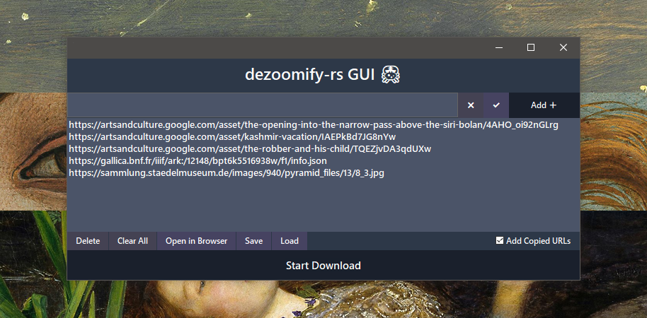
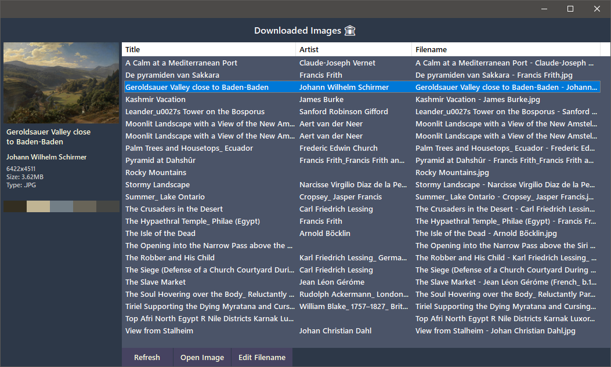

    <!--<h1>dezoomify-rs GUI 🦀</h1>-->
     
    
    
    

🦀 GUI for the tiled image downloader, <a href="https://github.com/lovasoa/dezoomify-rs">dezoomify-rs</a>. Written in <a href="https://wxpython.org/">wxPython</a>, builted with <a href="https://github.com/wxFormBuilder/wxFormBuilder">wxFormBuilder</a>.

## How to Use
1. _\*Not yet\*, Download [Latest Release](../../releases/latest)._
2. Download [dezoomify-rs](https://github.com/lovasoa/dezoomify-rs/releases), copy to same folder.

Run with Python:
1. Download [main.py](https://raw.githubusercontent.com/agmmnn/dezoomify-rs-gui/master/main.py)
4. Download [dezoomify-rs](https://github.com/lovasoa/dezoomify-rs/releases), copy to same folder.
2. `pip3 install -r requirements.txt`
3. `python main.py`

## Features:
- **Batch Download** : Download listed URLs.
- **Clipboard Listener** : Automatically add copied URLs from clipboard.
- **Save-Load** : Save and load URLs from list.txt file.
- **Downloaded Images Library** : List of downloaded images. If the filename format is "a - b.ext", the title and artist name can also be listed.
- **Image Palette** : Get 5 dominant colors from the image. Click and copy the hex code to the clipboard.

## TODO:
- [x] Get Batch Image Links from User Gallery, Story, Artist Profile URLs on Google Arts.
- [ ] Cross-Platform Support.
- [ ] Stop Download Process.
- [ ] Detailed Download Report.
- [ ] ProgressBar for Download.
- [ ] Parallel Download.
- [ ] Select Zoom Level.
- [ ] Advanced Settings.

## Requirements:
* [Python 3+](https://www.python.org/downloads/)
* [dezoomify-rs](https://github.com/lovasoa/dezoomify-rs/releases)

Dependencies:
- wxPython (GUI Framework)
- pyperclip (Clipboard Control)
- Pillow (Image Thumbnails)
- Haishoku (Palette)
- requests, beautifulsoup4 (Find Batch Images)

### Contributing
Your contributions are always welcome.

### License
CC0